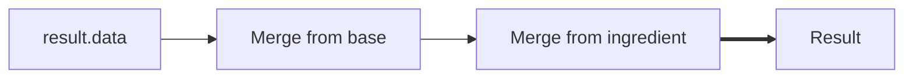

# Nbt Merging

This page extends upon the syntax of simple [dollars](../dollars), by using the special `$` key inside of `data`.
If you're unfamiliar with that, you should go and understand the basic principles of dollars first.

This site first focuses on specific use cases and then later goes into deeper detail with the [specification](#specification).
You can jump to specific sections of this site in the navigation menu.

## Rationale

While the simple dollars are usually enough to calculate values for a few fields,
they aren't able to model certain common recipe behaviors.

Merge dollars are an extension that allow to copy data from ingredients
and selectively specify how conflicts like multiple enchantments should be handled.

An important thing to understand is,
that the data object you specify is treated as the base where all the merges are applied to.

An example process to determine the result may be as following.


## Copying data from a single source

The simplest case of a "merge" is to copy NBT data from a single source.  
In vanilla Minecraft, an example for these kinds of recipes are smithing recipes,
where all NBT data from the `base` ingredient is just directly copied over.

For example, a recipe upgrading an iron sword to a diamond sword could be written as following:

```json
--8<-- "merging/simple_copy.json"
```

you may also add data to the sword by using additional keys besides the `$` key.
the next example recipe allows you to create an iron sword with a purple name.
when using the recipe, echantments will be transferred but the name will always be replaced by the new one.

```json
--8<-- "merging/simple_copy_additions.json"
```

## Combining lists

soon you might get to a point where you want to combine some nbt lists.
for our example we're gonna create a recipe that always appends the name of an item to the lore of another item.

Just specifying `"Lore": [ "$ i0.display.Name" ]` wouldn't work here, as this would just replace the lore completely.

There is an extended syntax of the merging that allows us to change this behavior for certain paths.
The merge is no longer just a string, but an object with a `value` and a `paths` attribute.

While the former is just the same as our string previously, the latter is what allows us to change the merging.

The `paths` attribute is an object that uses paths as keys and a string with the name of the mrege mode we want as the value.
In this case our path to the lore is `display.Lore` and we want the mode `prepend`.
The example should illustrate the syntax:

```json
--8<-- "merging/add_to_list.json"
```

!!!info "Why `prepend` and not `append`?"
	When merging, we're considering our `result.data` object as base and `i0` as the new data.
	So we're basically saying put the list from `i0` in front of `result.data`.  

!!!black "Why `"$ [ i0.display.Name ]"` and not `[ "$ i0.display.Name" ]`?"
	While writing this documentation I found a bug where the latter version glitched out for some reason.

	I was unable to find the cause of this, so for now you'll have to do it this way with lists of strings.
	Lists of objects seem to work fine though.

Apart from `prepend`, there are a bunch of other merge modes available, such as `merge` (the default), `keep` or `append`.
The full explanation of these merge modes is available [further down the page](#merge-modes).

## Combining lists without duplicates

The last section showed you how to combine lists.
In practice, you often want to combine lists of `Enchantments` or `AttributeModifiers`.

For both of these cases you don't want to have duplicates in there.
`Enchantments` are unique by their `id` and `AttributeModifiers` by their `UUID`.

To get this working in code, we need to step up our syntax even further.
In the last section, we learned about specific merge modes.
For this level of customization these standardized merge modes are not enough though.

Nbt Crafting v3 allows you to create your own kind of specialized merge functions using dollar expressions.
To make use of these we'll just use a dollar as the first character of our merge mode.

This dollar expression will receive the variables `base` and `addition`, and should return a combined result.
For our enchantment example we could use: `$ distinct(combine(base, addition), e -> e.id)`.

Let's digest this bit by bit:

`combine(base, addition)`:
:	This does nothing more than to simply append one list to the other.

`e -> e.id`:
:	This is a lambda expression that takes an element from the list,
	in this case an enchantment and returns it's `id`.

	For `{lvl: 2, id: "minecraft:sharpness"}`, this would resolve to `minecraft:sharpness`

`distinct(...)`:
:	This is a function that filters duplicate items out of a list.
	The first argument is the list to filter, which in our case is the combined list.

	The second argument is a lambda that tells the function how to determine equality.
	In this case, we use our lambda to tell `distinct` that it should distinguish enchantments by their `id` only.

Finally this is what our recipe could look like (this is a simplified version of the [full enchantment example below](#complex-enchantment-crafting)):

```json
--8<-- "merging/simple_add_enchantment.json"
```

## Multiple sources

From time to time, we want to combine the NBT data from multiple ingredients.
The syntax for this is actually pretty simple, as we just replace the object/string we previously used with an array of these elements.

Here's an example that allows you two combine two enchanted books (this simple example doesn't handle duplicates).

!!!error "Broken recipe"
	At the time of writing this recipe doesn't work correctly,
	because Nbt Crafting fails to resolve the references correctly in crafting recipes with multiple of the same items.
	See #47 and #57.

```json
--8<-- "merging/multiple_sources.json"
```

!!!info "A note about `Enchantments` and `StoredEnchantments`"
	While both echanted gear and enchanted books use the same data format (`id` and `lvl`),
	the former use `Enchantments` and the latter `StoredEnchantments`.

	This is a common source of confusion, so keep that in mind.

!!!warning "Mixing objects and strings"
	While the specification allows mixing objects with `paths` and simple strings together,
	the actual implementation currently doesn't support this due limitations with NBT lists.

## Complex enchantment crafting

The following provides a more complete example of how you could implement adding one enchantment level per craft:

```json
--8<-- "merging/complex_add_enchantment.json"
```

## Specification

A merge dollar is identified by a `$` key at any position of a `data` tag.
The data from the merges will always be merged into the parent object of the `$` tag.

The content of a dollar merge declaration is an array of merge entries.
If there is only a single merge entry, the list may be omitted and the entry can be specified directly.

A merge entry is an object consisting of a `value` and optionally a `paths` tag:

`value`:
:	The `value` tag is a dollar expression *without a leading dollar*.
	It may reference any of the ingredients and may return arbitrary data, except `null`.

`paths`:
	The `paths` tag is an object of paths specified in the keys that map to merge modes.
	The paths may either be simple JSON paths (with dots for object access and brackets for list access) or
	may be regular expressions.  
	In case of regular expressions they must both begin and end with a forward slash (`/`).
	Pay attention that you'll have to escape backslashes and quotes inside of the JSON string.

### Merge modes

The supported built-in merge modes are (with `B` being the base and `A` being the addition):

| Mode        | General behavior                         | Object behavior          | List behavior                                      |
|-------------|------------------------------------------|--------------------------|----------------------------------------------------|
| `merge`     | `A`, if `B` doesn't exist, otherwise `B` | Recurses into the object | Recurses into the list, comparing indexes directly |
| `keep`      | `A`, if `B` doesn't exist, otherwise `B` | -                        | -                                                  |
| `overwrite` | `A` (removes `B` if it doesn't exist)    | -                        | -                                                  |
| `update`    | `A`, if `B` exists, otherwise nothing    | -                        | -                                                  |
| `preprend`  | `A`, if `B` doesn't exist, otherwise `B` | -                        | Puts the elements of `A` in front of `B`           |
| `append`    | `A`, if `B` doesn't exist, otherwise `B` | -                        | Puts the elements of `A` after `B`                 |

### Custom merge modes

Custom merge modes may be specified by beginning the merge mode with a dollar (`$`).
The following dollar expression will be evaluated with the variables `base` and `addition`.

Returning `null` will remove the value from the parent object.
